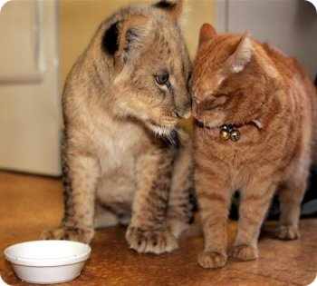
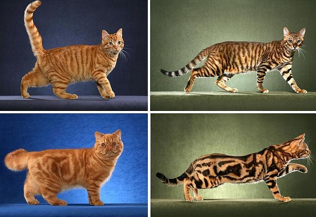
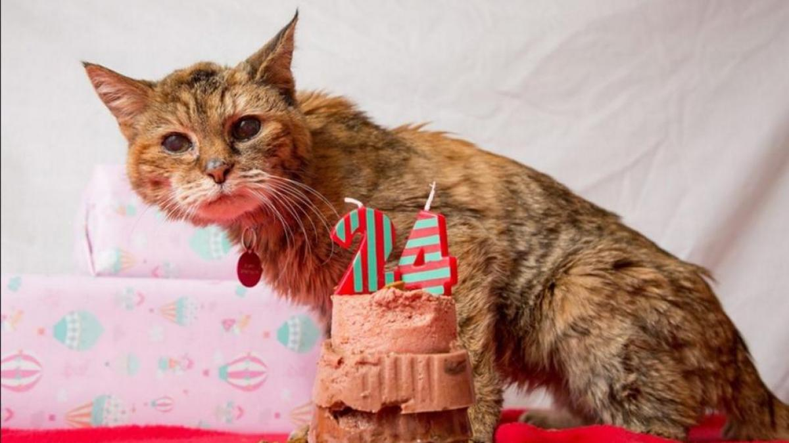
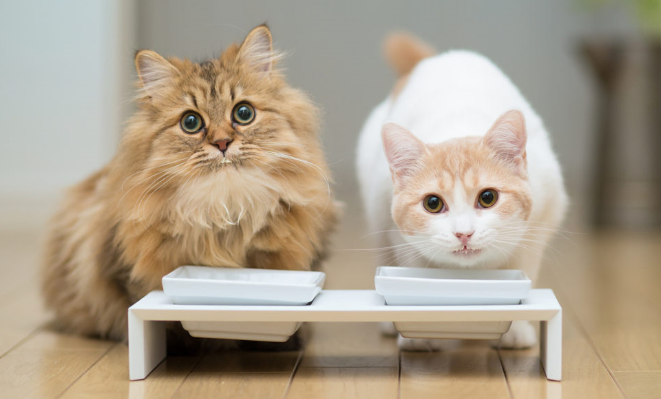

<html>
<body bgcolor="#AF7AC5">
<h1 align="center">  
Felinos   
</h1>
  

 
<h2><u>¿Que es un Felino?</u></h2> 
<h3>Los félidos o comúnmente llamados felinos son una 
familia de mamíferos placentarios del orden Carnivora. 
La mayoría consume exclusivamente carne e ignora cualquier otra comida 
que no sea una presa viva. </h3>

<h2><u>¿Cuales son los rasgos caracteristocos de los Felinos?</u></h2> 
<h3>
Poseen un cuerpo esbelto, oído agudo, hocico corto y excelente vista. 
Son los mamíferos cazadores más sigilosos
</h3> 

<h2><u>¿Cuanto es el promedio de vida de un felino?</u> </h2>
<h3>Felinos "Domesticos" 
Gato: 2 - 16 años 
Felinos "Salvajes" 
León: 10 - 15 años 
Leopardo: 12 - 15 años 
Jaguar: 12 - 17 años 
Puma: 8 - 13 años 
Tigre: 8 - 10 años 
Etc... </h3>
<h5><i>En felinos domesticos depende del cuidado 
dado al animal seran los años que viva</i></h5> 

<h2><u>¿Cuales son los felinos domesticos más populares del mundo?</u> </h2>
<h3>
Gato persa: un conquistador por excelencia 
Siamés: el más cariñoso de todos 
Gato ruso azul: pura elegancia 
Bobtail americano: siempre dispuesto para jugar 
Somalí: enigmático y distinguido 
Siberiano: la mirada más salvaje y cautivadora 
Ragdoll: el dulce muñeco de trapo 
Maine coon: un hermoso gigante 
Manés o manx: el adorable gato sin cola 
Birmano o burmés: un felino muy sociable 
Etc...
</h3>
 

<h2><u>¿Cual es el felino mas grande del mundo?</u> </h2>
<h3>Los tigres son los felinos más grandes del mundo, pudiendo llegar a medir 3,8 metros de largo 
(incluyendo la cola) y alcanzar los 300 kilos. 
Por su parte, los leones suelen pesar entre 150 y 250 kilos, y medir entre 2 y 3,3 metros. 
Como curiosidad, los leones tienen la cola más larga que los tigres.</h3>
 

Alumna: Veronica Castelan Baez  Grupo: 401

</body>
</html>
